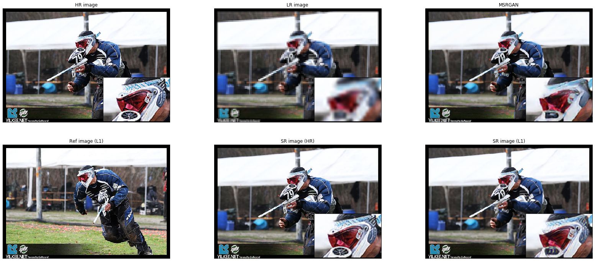

# srntt-pytorch
A PyTorch implementation of SRNTT[1], which is a novel Reference-based Super-Resolution method proposed in CVPR 2019.

## Requirements
### Python
```shell
$ python --version
Python 3.7.4
```

### Packages
Mainly used packages are below:
```
- torch
- torchvision
- kornia
- scikit-learn etc., see more in Pipfile
```
This Python environment is managed by `pipenv`, so you can create a virtual environmet like below:
```shell
$ pipenv install
```

### [WIP] Working with Docker 🐳
#### Build Docker image
```shell
$ sudo docker build -t srntt-pytorch .
```
#### Run Docker container
```shell
$ sudo docker run --rm --runtime nvidia -it srntt-pytorch /bin/bash
```

## Training
### Get started
```shell
$ sh scripts/train.sh
```
More detailed descriptions are provided in the following sections.

### Downloading data
You can get data through the following command, which is provided by the author.
```shell
$ python download_dataset.py --dataset_name DATASE_NAME
```
The available dataset names are `{DIV2K, CUFED, CUFED5}`. `DIV2K` and `CUFED` datasets can be used as train data, and `CUFED5` can be used as test data.
The downloaded data will be placed in `./data` directory.

### Downloading a pre-trained weight
In the training of SRNTT, the initial weights for content extractor is set as pre-trained SRGAN model. In this implementation, we exploit Modified-SRGAN (MSRGAN) provided by MMSR bacause it is thought as a reliable source. Let's download it as below!
```shell
$ python download_pretrained_model.py
```

### Offline texture swapping
SRNTT requires HR-LR image pairs and the corresponding reference(Ref) images, moreover the swapped feature maps culculated from LR-Ref images.
The calculation is time-comsuming and has high comtational costs.

In general, the swapped feature maps of train data is culculated offline to speed up the training.
The offline calculation will be done by the following command.
```shell
$ python offline_texture_swapping.py --dataroot DATSET_NAME
```

### Training SRNTT
All of the preparation was done as above, so let's train the networks.
We recommend to use `--use_weights` option at all times (appeared in Eq. (6)).
```shell
$ python train.py --use_weights
```

## Testing
You can test on `CUFED5` dataset as below.
If you have not used `--use_weights` option in the training, you don't have to specify the option.
```shell
$ python test.py -w ./runs/your/pth/path --use_weights
```

## Online inference on any images
Now, we support online inference on any images.
The input image you specify will be x4 downscaled by bicubic, and super-resolved with your ref image.
```shell
$ python online_inference.py -w ./runs/your/pth/path -i ./your/input/image -r ./your/ref/image --use_weights
```

## Pretrained models
You can get pretrained models from [here](https://drive.google.com/drive/folders/1yrIft2GXcDR-IW_uFLy69caVqEaByFDf?usp=sharing).


## Results
`HR/LR image` means GT/input image. `MSRGAN` is the result of MSRGAN from MMSR. `SR image (HR)` indicates super-resolved image with HR image itself, and `SR image (Lx)` indicates super-resolved one with a similar reference (left bottom) image.




See the other results and metrics [here](https://drive.google.com/drive/folders/1ZMmlJD4gHVYUCisRr785h_04zMDyTjC-?usp=sharing).

## Reference
Thanks you for the following!
### Papers
1. Zhang, Zhifei, et al. "Image Super-Resolution by Neural Texture Transfer." Proceedings of the IEEE Conference on Computer Vision and Pattern Recognition. 2019.
### Implementations
1. The original implementation (TF) - https://github.com/ZZUTK/SRNTT
1. MMSR - https://github.com/open-mmlab/mmsr
