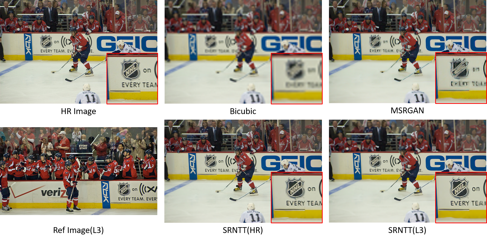
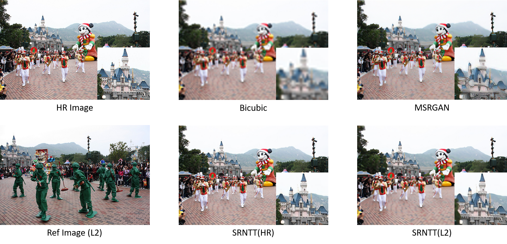

# srntt-pytorch
This repository contains a PyTorch implementation of SRNTT[1], which is a Reference-based Super-Resolution method proposed in CVPR 2019.


## Requirements
### Python
```shell
$ python --version
Python 3.7.4
```

### Packages
Mainly used packages is below:
```
- torch
- torchvision
- kornia
- scikit-learn etc.
```
This Python environment is managed by `pipenv`, so you can create a virtual environmet like below:
```shell
$ pipenv install
```

### [WIP] Working with Docker
#### Build Docker image
```shell
$ sudo docker build -t srntt-pytorch .
```

#### Run Docker container
```shell
$ sudo docker run --rm --runtime nvidia -it srntt-pytorch /bin/bash
```

## Usage
### Downloading data
You can get data through the following command, which is provided by the author.
```shell
$ python download_dataset.py --dataset_name DATASE_NAME
```
The available dataset names are `{ DIV2K, CUFED, CUFED5 }`. `DIV2K` and `CUFED` datasets can be used as train data, and `CUFED5` can be used as test data.
The downloaded data will be placed in `./data` directory.

### Downloading a pre-trained weight
In the training of SRNTT, the initial weights for content extractor is set as pre-trained SRGAN model. In this implementation, we exploit Modified-SRGAN (MSRGAN) provided by MMSR bacause it is thought as a reliable source. Let's download it as below!
```shell
$ python download_pretrained_model.py
```

### Offline texture swapping
SRNTT requires HR-LR image pairs and the corresponding reference(Ref) images, moreover the swapped feature maps culculated from LR-Ref images.
The calculation is time-comsuming and has high comtational costs.

In general, the swapped feature maps of train data is culculated offline to speed up the training.
The offline calculation will be done by the following command.
```shell
$ python offline_texture_swapping.py --dataroot DATSET_NAME
```

### Train SRNTT
All of the preparation was done as above, so let's train the network.
```shell
$ python train.py
```
Almost all hyper-parameters is belongs to the original implementation.

## Results
[NOTE] The results shown here are not based on current commits, but the transfer ability is proven from the results. The current codes is improved more about texture information.
### The effect of texture transfer 
- NHL logo are transfered properly.

- The correct structure of the catsle can be seen.


### Other interesting results
Look at the grandma in SR images!
Even if the same person doesn't appear in the reference image, someone's face will be transfered to the grandma's face.


## Reference
Thanks you for the authors and the owners!

### Papers
1. Zhang, Zhifei, et al. "Image Super-Resolution by Neural Texture Transfer." Proceedings of the IEEE Conference on Computer Vision and Pattern Recognition. 2019.

### Implementations
1. The original implementation (TF) - https://github.com/ZZUTK/SRNTT
1. MMSR - https://github.com/open-mmlab/mmsr
